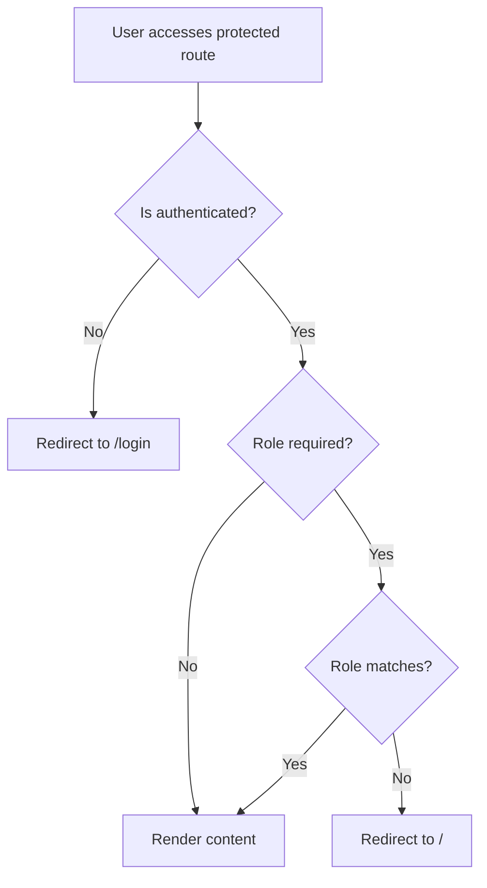

The application uses the `RutaProtegida` component to restrict access to certain routes based on authentication status and user roles.

## RutaProtegida Component

The route protection component is located at `/workspace/source/src/auth/RutaProtegida.jsx` and implements a simple but effective access control system.

### Component Structure

```jsx
function RutaProtegida({ isAuthenticated, children, role, requeridRole }) {
  if (!isAuthenticated) {
    return <Navigate to="/login" replace />;
  }
  if (requeridRole && role !== requeridRole) {
    return <Navigate to="/" replace />;
  }
  return children;
}
```

Reference: `/workspace/source/src/auth/RutaProtegida.jsx:4-12`

## How It Works

The component performs two levels of validation:

### Level 1: Authentication Check

<Steps>
  <Step title="Check if user is authenticated">
    If `isAuthenticated` is `false`, the user is redirected to `/login`
    
    ```jsx
    if (!isAuthenticated) {
      return <Navigate to="/login" replace />;
    }
    ```
  </Step>
  
  <Step title="Allow authenticated users">
    If authenticated, proceed to the next validation level
  </Step>
</Steps>

### Level 2: Role-Based Access

<Steps>
  <Step title="Check if role is required">
    If `requeridRole` is specified, validate the user's role
    
    ```jsx
    if (requeridRole && role !== requeridRole) {
      return <Navigate to="/" replace />;
    }
    ```
  </Step>
  
  <Step title="Validate role match">
    If the user's `role` doesn't match `requeridRole`, redirect to home page
  </Step>
  
  <Step title="Grant access">
    If role matches (or no role required), render the protected content
    
    ```jsx
    return children;
    ```
  </Step>
</Steps>

## Props

<ParamField path="isAuthenticated" type="boolean" required>
  Whether the user is currently authenticated
</ParamField>

<ParamField path="children" type="React.ReactNode" required>
  The protected component/content to render if access is granted
</ParamField>

<ParamField path="role" type="string">
  The current user's role (e.g., "admin" or "cliente")
</ParamField>

<ParamField path="requeridRole" type="string">
  The role required to access this route (e.g., "admin")
</ParamField>

## Usage Example

Protecting the admin route:

```jsx
<RutaProtegida 
  isAuthenticated={isAuthenticated} 
  role={role} 
  requeridRole="admin"
>
  <Admin />
</RutaProtegida>
```

This ensures:
1. User must be logged in
2. User must have the "admin" role
3. Otherwise, redirect appropriately

## Access Flow Diagram



## Integration with Auth System

The `RutaProtegida` component works in conjunction with `AuthContext`:

<Steps>
  <Step title="User logs in">
    `AuthContext` validates credentials and sets:
    - `isAuthenticated` to `true`
    - `role` to user's role from users.json
    - Stores both in localStorage
  </Step>
  
  <Step title="Route protection activated">
    When user navigates to a protected route, `RutaProtegida` checks:
    - Authentication status from `AuthContext`
    - User role from `AuthContext`
  </Step>
  
  <Step title="Access decision">
    Based on validation results:
    - Grant access and render protected content
    - Redirect to login if not authenticated
    - Redirect to home if wrong role
  </Step>
</Steps>

## Common Scenarios

<AccordionGroup>
  <Accordion title="Anonymous user tries to access admin panel">
    **Result**: Redirected to `/login`
    
    **Reason**: `isAuthenticated` is `false`
  </Accordion>
  
  <Accordion title="Client user tries to access admin panel">
    **Result**: Redirected to `/` (home page)
    
    **Reason**: `role` is "cliente" but `requeridRole` is "admin"
  </Accordion>
  
  <Accordion title="Admin user accesses admin panel">
    **Result**: Access granted
    
    **Reason**: `isAuthenticated` is `true` and `role` matches `requeridRole`
  </Accordion>
  
  <Accordion title="Authenticated user accesses unprotected route">
    **Result**: Access granted
    
    **Reason**: No `requeridRole` specified, only authentication required
  </Accordion>
</AccordionGroup>

## Security Considerations

<Warning>
  This is a client-side route protection mechanism. It prevents UI access but does not provide server-side security.
</Warning>

<CardGroup cols={2}>
  <Card title="What it protects" icon="shield-check" color="#10b981">
    - UI routes and components
    - User experience flow
    - Prevents accidental access
  </Card>
  <Card title="What it doesn't protect" icon="shield-xmark" color="#ef4444">
    - API endpoints (needs backend auth)
    - Direct data access
    - Malicious users with dev tools
  </Card>
</CardGroup>

<Note>
  For production applications, always implement:
  - Server-side authentication
  - API endpoint protection
  - Token-based authentication (JWT)
  - Secure password hashing
</Note>

## Persistence Across Refreshes

The protection system maintains state across page refreshes by checking localStorage:

```jsx
// In AuthContext
useEffect(() => {
  const isAuthenticated = localStorage.getItem('isAuth') === 'true'
  const userRole = localStorage.getItem('role') || '';

  if (isAuthenticated && userRole === 'admin') {
    setIsAuth(true)
    setRole(userRole)
    navigate('/admin')
  }
}, [])
```

This ensures users remain logged in and maintain proper access levels even after page refreshes.