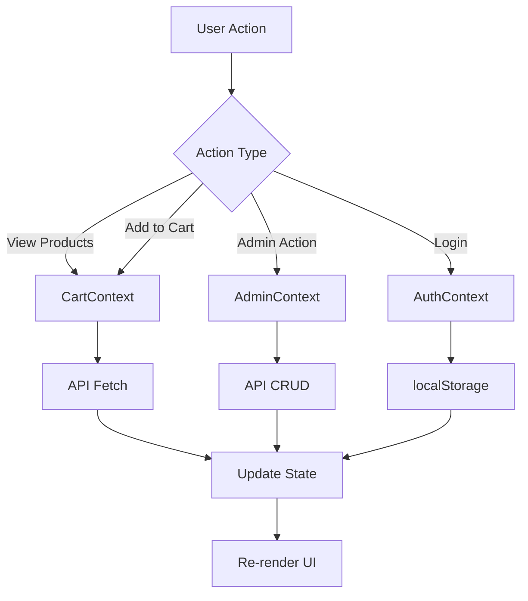

## Application Architecture

Tienda ETCA is built using a modern React architecture with a component-based structure. The application follows a clear separation of concerns with Context API for state management and React Router for navigation.

## Core Architecture Patterns

<CardGroup cols={2}>
  <Card title="Component-Based" icon="puzzle-piece">
    Modular UI components with clear responsibilities and reusable design
  </Card>
  <Card title="Context API" icon="share-nodes">
    Centralized state management for cart, authentication, and admin operations
  </Card>
  <Card title="React Router" icon="route">
    Client-side routing with protected routes and role-based access control
  </Card>
  <Card title="Vite Build" icon="bolt">
    Fast development server and optimized production builds
  </Card>
</CardGroup>

## Application Entry Point

The application initializes in `main.jsx` with a hierarchical provider structure:

```jsx
// Reference: ~/workspace/source/src/main.jsx:11-23
createRoot(document.getElementById('root')).render(
  <StrictMode>
    <Router>
      <AuthProvider>
        <CartProvider>
          <AdminProvider>
            <App />
          </AdminProvider>
        </CartProvider>
      </AuthProvider>
    </Router>
  </StrictMode>,
)
```

### Provider Hierarchy

The nested provider structure ensures proper context availability:

1. **Router** - Enables routing throughout the application
2. **AuthProvider** - Manages authentication state and user roles
3. **CartProvider** - Handles shopping cart state and product data
4. **AdminProvider** - Controls admin panel operations and product management

## Routing Architecture

The routing system is defined in `App.jsx` using React Router v7:

```jsx
// Reference: ~/workspace/source/src/App.jsx:24-40
<Routes>
  <Route path="/" element={<Home/>}/>
  <Route path="/productos" element={<GaleriaProductos/>}/>
  <Route path="/productos/:id" element={<DetallesProductos/>}/>
  <Route path="/acercade" element={<AcercaDe />}/>
  <Route path="/contacto" element={<Contacto />}/>
  <Route path='/admin' element={
    <RutaProtegida isAuthenticated={isAuthenticated} requeridRole='admin' role={role}>
      <Admin />
    </RutaProtegida>
  }/>
  <Route path='/login' element={<Login />}/>
  <Route path="*" element={<NotFound />}/>
</Routes>
```

### Route Protection

The `RutaProtegida` component (~/workspace/source/src/auth/RutaProtegida.jsx) implements role-based access control:

<Accordion title="Protected Route Implementation">
  ```jsx
  function RutaProtegida({ isAuthenticated, children, role, requeridRole }) {
    if (!isAuthenticated) {
      return <Navigate to="/login" replace />;
    }
    if (requeridRole && role !== requeridRole) {
      return <Navigate to="/" replace />;
    }
    return children;
  }
  ```
  
  This ensures:
  - Unauthenticated users are redirected to login
  - Users without required roles are redirected to home
  - Admin routes are only accessible to admin users
</Accordion>

## State Management with Context API

The application uses three main contexts for state management:

### 1. AuthContext

**Location:** `~/workspace/source/src/context/AuthContext.jsx`

**Responsibilities:**
- User authentication and login
- Role-based authorization (admin/cliente)
- Session persistence with localStorage
- Navigation after authentication

**Key State:**
```jsx
const [isAuthenticated, setIsAuth] = useState(false)
const [role, setRole] = useState('')
const [email, setEmail] = useState('')
const [password, setPassword] = useState('')
```

### 2. CartContext

**Location:** `~/workspace/source/src/context/CartContext.jsx`

**Responsibilities:**
- Shopping cart state management
- Product data fetching from API
- Cart operations (add, remove, update quantity)
- Product search and filtering

**Key Operations:**
- `handleAddToCart(product)` - Adds or increments product quantity
- `borrarProducto(product)` - Decrements quantity or removes item
- `eliminarProducto(product)` - Removes product completely
- `vaciarCarrito()` - Clears entire cart

**API Integration:**
```jsx
// Fetches products from MockAPI
fetch("https://681cdce3f74de1d219ae0bdb.mockapi.io/tiendatobe/productos")
```

### 3. AdminContext

**Location:** `~/workspace/source/src/context/AdminContext.jsx`

**Responsibilities:**
- Admin product management (CRUD operations)
- Product list state for admin panel
- Modal state for create/edit forms
- API interactions for product updates

**CRUD Operations:**
- `agregarProducto(producto)` - POST new product
- `actualizarProducto(producto)` - PUT update existing product
- `eliminarProducto(id)` - DELETE product
- `cargarProductos()` - GET all products

## Component Structure

The application follows a clear component hierarchy:

<Accordion title="Layout Components">
  **Purpose:** Full page layouts
  
  - `Home` - Landing page
  - `GaleriaProductos` - Product listing page
  - `DetallesProductos` - Product detail page
  - `AcercaDe` - About page
  - `Contacto` - Contact page
  - `Login` - Authentication page
  - `Admin` - Admin dashboard
</Accordion>

<Accordion title="UI Components">
  **Purpose:** Reusable UI elements
  
  - `Header` - Navigation and cart icon
  - `Footer` - Site footer
  - `Cart` - Shopping cart modal
  - `Product` - Individual product card
  - `ProductList` - Product grid display
  - `NotFound` - 404 error page
</Accordion>

<Accordion title="Form Components">
  **Purpose:** Data input and management
  
  - `Formulario` - Contact form
  - `FormularioProducto` - New product form
  - `FormularioEdicion` - Edit product form
  - `ListaUsuarios` - User management
</Accordion>

## Notification System

The application uses two notification libraries:

### React Toastify

Used for cart operations and user feedback:

```jsx
// Reference: ~/workspace/source/src/App.jsx:14-15,41
import { ToastContainer } from 'react-toastify';
import 'react-toastify/dist/ReactToastify.css';

// In CartContext:
toast.success(`"${product.nombre}" agregado al carrito`);
toast.info(`Cantidad aumentada para "${product.nombre}"`);
```

### SweetAlert2

Used for admin confirmations and alerts:

```jsx
// Example from AdminContext
Swal.fire({
  title: "Realizado!",
  text: "Producto agregado correctamente!",
  icon: "success"
});
```

## Data Flow



## Key Design Decisions

<AccordionGroup>
  <Accordion title="Why Context API over Redux?">
    Context API provides sufficient state management for this application size without the complexity of Redux. The three contexts (Auth, Cart, Admin) have clear boundaries and minimal prop drilling.
  </Accordion>
  
  <Accordion title="Why MockAPI for backend?">
    MockAPI provides a quick REST API for prototyping without backend infrastructure. It supports full CRUD operations suitable for this e-commerce demo.
  </Accordion>
  
  <Accordion title="Why localStorage for auth persistence?">
    Simple session persistence across page refreshes. Stores authentication status and user role for role-based access control.
  </Accordion>
</AccordionGroup>

## Next Steps

<CardGroup cols={2}>
  <Card title="Project Structure" icon="folder-tree" href="/development/project-structure">
    Explore the detailed file and directory organization
  </Card>
  <Card title="Technologies" icon="layer-group" href="/development/technologies">
    Learn about the tech stack and dependencies
  </Card>
</CardGroup>