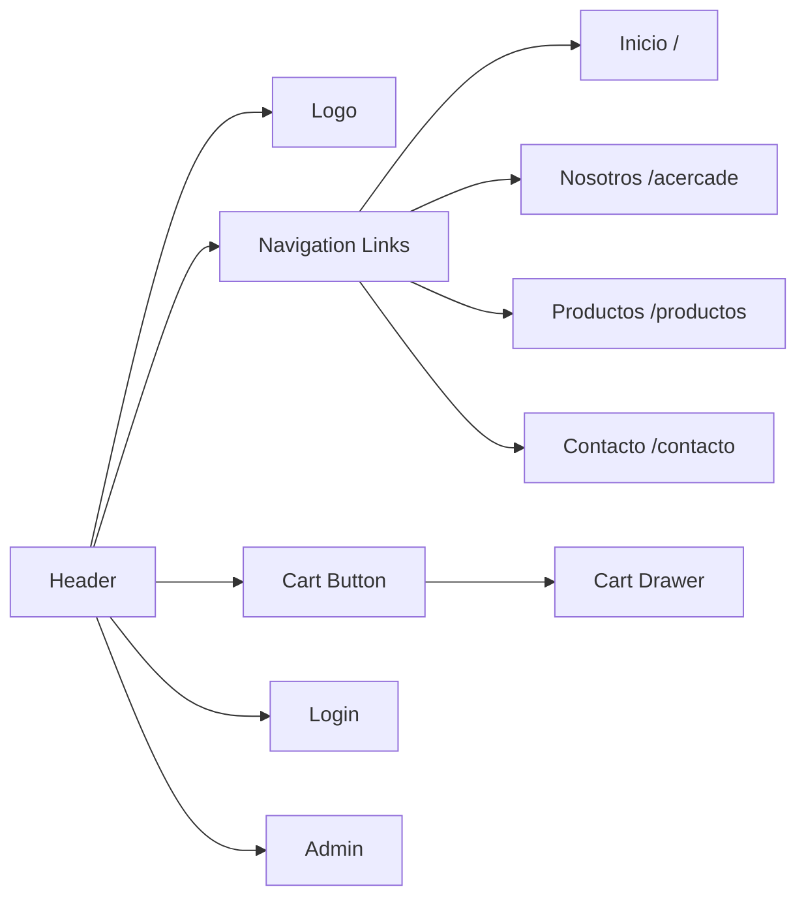

# Layout Components

Layout components provide the structural foundation for the Tienda ETCA application. These components handle navigation, branding, and consistent page structure across all views.

## Header Component

The Header component provides primary navigation and access to key application features.

**File:** `src/components/Header.jsx`

### Overview

The Header is a persistent navigation bar that appears on most pages, providing access to main sections, shopping cart, and user authentication.

<Frame>
  
</Frame>

### Component Structure

```jsx Header.jsx
import React, { useContext } from 'react';
import './style/Header.css';
import logo from '../assets/ETCAicon150.png';
import Cart from './Cart';
import { NavLink } from 'react-router-dom';
import { CartContext } from '../context/CartContext';

const Header = () => {
  const {cartCount, isCartOpen, setCartOpen } = useContext(CartContext)
  
  return (
    <header className="header">
      <div className="header-top">
        <h2>ESCUELA DE TIRO CON ARCO</h2>
      </div>
      
      <nav>
        <ul>
          
          <li><NavLink to='/' className='link'>Inicio</NavLink></li>
          <li><NavLink to='/acercade' className='link'>Nosotros</NavLink></li>
          <li><NavLink to='/productos' className='link'>Galería de productos</NavLink></li>
          <li><NavLink to='/contacto' className='link'>Contacto</NavLink></li>
          <li className='cartNav'>
            <button className='btnCart' onClick={() => setCartOpen(true)}>
              [{cartCount}]<i className="fa-solid fa-cart-shopping"></i>
            </button>
            <Cart isOpen={isCartOpen} onClose={() => setCartOpen(false)}/>
          </li>
          <li className='btnLogin'>
            <NavLink to='/login' className='link'>
              <i className="fa-solid fa-right-to-bracket"></i>
            </NavLink>
          </li>
          <li className='btnAdmin'>
            <NavLink to='/admin' className='link'>
              <i className="fa-solid fa-user"></i>
            </NavLink>
          </li>
        </ul>
      </nav>
    </header>
  );
};

export default Header;
```

### Features

<AccordionGroup>
  <Accordion title="Navigation Menu" icon="bars">
    Provides links to main application sections:
    - **Inicio** (`/`) - Home page
    - **Nosotros** (`/acercade`) - About us
    - **Galería de productos** (`/productos`) - Product catalog
    - **Contacto** (`/contacto`) - Contact page
    
    Uses React Router's `NavLink` for active state styling.
  </Accordion>

  <Accordion title="Branding" icon="image">
    Displays the ETCA logo and school name:
    - Logo image: `ETCAicon150.png`
    - School name: "ESCUELA DE TIRO CON ARCO"
  </Accordion>

  <Accordion title="Shopping Cart" icon="cart-shopping">
    Interactive cart button showing item count:
    - Displays current cart item count from CartContext
    - Opens Cart drawer on click
    - Uses Font Awesome cart icon
    - Format: `[count]` with shopping cart icon
  </Accordion>

  <Accordion title="User Authentication" icon="user">
    Access buttons for user features:
    - **Login button** - Links to `/login`
    - **Admin button** - Links to `/admin` dashboard
    - Uses Font Awesome icons
  </Accordion>
</AccordionGroup>

### Context Dependencies

<CodeGroup>
```jsx CartContext Integration
import { CartContext } from '../context/CartContext';

const Header = () => {
  const {cartCount, isCartOpen, setCartOpen } = useContext(CartContext)
  // ...
}
```
</CodeGroup>

**Required Context Values:**
- `cartCount` - Number of items in cart
- `isCartOpen` - Boolean for cart drawer state
- `setCartOpen` - Function to toggle cart drawer

### Navigation Structure



### Styling

**CSS File:** `src/components/style/Header.css`

<Note>
  The Header uses custom CSS for layout and styling. The navigation is responsive and adapts to different screen sizes.
</Note>

---

## Footer Component

The Footer provides site-wide information, navigation, and contact details.

**File:** `src/components/Footer.jsx`

### Overview

A multi-column footer displaying company information, navigation links, contact details, and accepted payment methods.

### Component Structure

```jsx Footer.jsx
import React from 'react';
import './style/Footer.css';
import { Link } from 'react-router-dom';

const Footer = () => {
  return (
    <footer className="footer">
      <div className="footer-column">
        <h3>ETCA</h3>
        <p>Lorem ipsum dolor sit amet consectetur adipisicing elit. 
           Voluptatum molestias assumenda reiciendis.</p>
        <h3>Envíos</h3>
        <p>Envíos exprés en CABA y GBA</p>
        <p>Envíos a toda la Argentina en 72hs</p>
      </div>

      <div className="footer-column">
        <h3>Navegación</h3>
        <ul>
          <li><Link to="/">Inicio</Link></li>
          <li><Link to="/productos">Productos</Link></li>
          <li><Link to="/acercade">Nosotros</Link></li>
          <li><Link to="/contacto">Contacto</Link></li>
        </ul>
      </div>

      <div className="footer-column">
        <h3>Contacto</h3>
        <p>CABA, Argentina</p>
        <p><a href="mailto:mail@mail.com">mail@mail.com</a></p>
        <p>+54 9 11 2233 4455</p>

        <h3>Medios de pago</h3>
        <ul>
          <li>Visa</li>
          <li>Mastercard</li>
          <li>PayPal</li>
        </ul>
      </div>

      <div className="footer-copy">
        <p>&copy; 2025 - Alberto Vildoza. Mi primer proyecto.</p>
      </div>
    </footer>
  );
};

export default Footer;
```

### Features

<CardGroup cols={3}>
  <Card title="Company Info" icon="building">
    - Company description
    - Shipping information
    - Service areas (CABA, GBA, Argentina)
  </Card>
  <Card title="Navigation" icon="compass">
    - Quick links to main pages
    - Uses React Router Link
    - Mirrors header navigation
  </Card>
  <Card title="Contact" icon="phone">
    - Location: CABA, Argentina
    - Email link
    - Phone number
    - Payment methods
  </Card>
</CardGroup>

### Footer Sections

<Tabs>
  <Tab title="Column 1">
    **Company & Shipping**
    
    - ETCA branding
    - Company description
    - Shipping information:
      - Express shipping in CABA and GBA
      - Nationwide delivery in 72 hours
  </Tab>
  <Tab title="Column 2">
    **Navigation Links**
    
    Quick access to main pages:
    - Inicio (`/`)
    - Productos (`/productos`)
    - Nosotros (`/acercade`)
    - Contacto (`/contacto`)
  </Tab>
  <Tab title="Column 3">
    **Contact & Payment**
    
    Contact Information:
    - Location: CABA, Argentina
    - Email: mail@mail.com
    - Phone: +54 9 11 2233 4455
    
    Payment Methods:
    - Visa
    - Mastercard
    - PayPal
  </Tab>
</Tabs>

### Styling

**CSS File:** `src/components/style/Footer.css`

<Info>
  The Footer uses a multi-column responsive layout that adapts to different screen sizes.
</Info>

---

## Main Components

Two hero section components providing flexible content layouts.

### Main Component

**File:** `src/components/Main.jsx`

#### Overview

A Bootstrap-based hero section with text content on the left and an image on the right.

#### Props

<ParamField path="titular" type="string" required>
  Section heading text
</ParamField>

<ParamField path="texto" type="string" required>
  Description or body text for the section
</ParamField>

<ParamField path="boton" type="string" required>
  Button label text
</ParamField>

<ParamField path="imagen" type="string" required>
  Image URL or path for the hero image
</ParamField>

#### Component Structure

```jsx Main.jsx
import React from 'react';
import 'bootstrap/dist/css/bootstrap.min.css';

const Main = ({ titular, texto, boton, imagen }) => {
  return (
    <main className="container py-5">
      <div className="row align-items-center bg-dark text-light p-4 rounded shadow">
        {/* Texto a la izquierda */}
        <div className="col-md-6 mb-4 mb-md-0">
          <h2 className="fw-bold mb-3">{titular}</h2>
          <p className="lead">{texto}</p>
          <button className="btn btn-success mt-3">{boton}</button>
        </div>

        {/* Imagen a la derecha */}
        <div className="col-md-6 text-center">
          
        </div>
      </div>
    </main>
  );
};

export default Main;
```

#### Usage Example

```jsx Example from Home.jsx
import Main from '../components/Main';
import tresArquerosBochin from '../assets/tresArquerosBochin.jpg';

<Main 
  titular='Contenido Principal' 
  texto='Bienvenido a nuestra aplicación. Aquí podrás descubrir productos únicos...'
  boton='Más'
  imagen={tresArquerosBochin}
/>
```

#### Layout Features

- **Two-column Bootstrap grid** - Responsive layout using `col-md-6`
- **Text on left** - Heading, description, and CTA button
- **Image on right** - Responsive image with max height constraint
- **Dark theme** - Uses Bootstrap `bg-dark text-light` classes
- **Styling** - Rounded corners and shadow for depth

---

### Main2 Component

**File:** `src/components/Main2.jsx`

#### Overview

Identical to Main component but with reversed layout - image on the left, text on the right.

#### Props

<ParamField path="titular" type="string" required>
  Section heading text
</ParamField>

<ParamField path="texto" type="string" required>
  Description or body text for the section
</ParamField>

<ParamField path="boton" type="string" required>
  Button label text
</ParamField>

<ParamField path="imagen" type="string" required>
  Image URL or path for the hero image
</ParamField>

#### Component Structure

```jsx Main2.jsx
import React from 'react';
import 'bootstrap/dist/css/bootstrap.min.css';

const Main = ({ titular, texto, boton, imagen }) => {
  return (
    <main className="container py-5">
      <div className="row align-items-center bg-dark text-light p-4 rounded shadow">
        {/* Imagen a la izquierda */}
        <div className="col-md-6 text-center mb-4 mb-md-0">
          
        </div>

        {/* Texto a la derecha */}
        <div className="col-md-6">
          <h2 className="fw-bold mb-3">{titular}</h2>
          <p className="lead">{texto}</p>
          <button className="btn btn-success mt-3">{boton}</button>
        </div>
      </div>
    </main>
  );
};

export default Main;
```

#### Usage Example

```jsx Example from Home.jsx
import Main2 from '../components/Main2';
import pines from "../assets/pinesETCA.jpg";

<Main2 
  titular='Contenido Secundario'
  texto='Lorem ipsum dolor sit amet consectetur adipisicing elit...'
  boton='Veritate'
  imagen={pines}
/>
```

#### Layout Features

- **Two-column Bootstrap grid** - Responsive layout using `col-md-6`
- **Image on left** - Responsive image with max height constraint
- **Text on right** - Heading, description, and CTA button
- **Dark theme** - Uses Bootstrap `bg-dark text-light` classes
- **Styling** - Rounded corners and shadow for depth

---

## Layout Comparison

<CodeGroup>
```jsx Main - Text Left, Image Right
<div className="row">
  <div className="col-md-6">    {/* Text */}  </div>
  <div className="col-md-6">    {/* Image */} </div>
</div>
```

```jsx Main2 - Image Left, Text Right
<div className="row">
  <div className="col-md-6">    {/* Image */} </div>
  <div className="col-md-6">    {/* Text */}  </div>
</div>
```
</CodeGroup>

<Tip>
  Use Main and Main2 alternately on the same page to create visual variety and maintain user engagement.
</Tip>

## Responsive Design

All layout components are fully responsive:

- **Header**: Adapts navigation for mobile devices
- **Footer**: Columns stack on smaller screens
- **Main/Main2**: Two-column layout becomes single-column on mobile (`col-md-6`)

## Dependencies

<CodeGroup>
```json Bootstrap
"bootstrap": "^5.x"
```

```json React Router
"react-router-dom": "^6.x"
```

```json Font Awesome
// Icons used in Header
- fa-cart-shopping
- fa-right-to-bracket
- fa-user
```
</CodeGroup>

## Related Documentation

<CardGroup cols={2}>
  <Card title="Components Overview" icon="list" href="/development/components/overview">
    See all available components
  </Card>
  <Card title="Context API" icon="layer-group" href="/development/architecture/context">
    Learn about CartContext integration
  </Card>
</CardGroup>